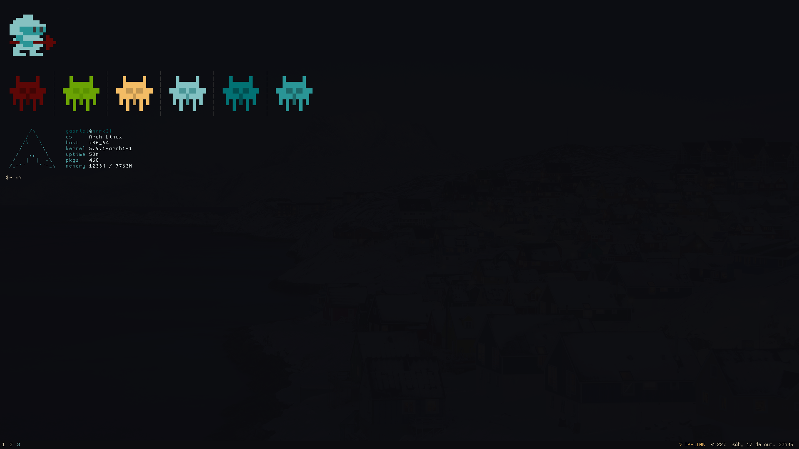

## dotfiles

My unix system configuration files.

System components currently are:
 
 - bash
 - X
 - i3wm
 - i3bar (with i3status)
 - dmenu
 - urxvt
 - picom

Other programs configured in this repository:

 - zsh
 - vim
 - zathura
 - polybar
 - rofi
 - kitty
